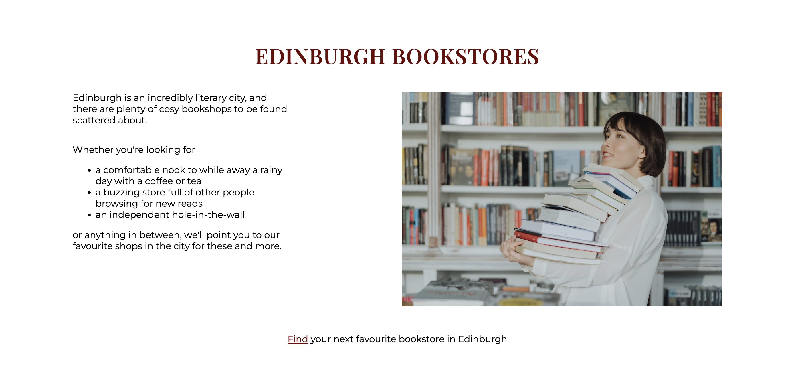
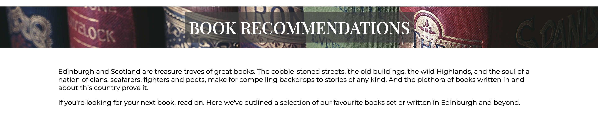

# Book Lovers Edinburgh

Book Lovers Edinburgh aims to be a one-stop-shop for book lovers who live in or are visiting Edinburgh. It provides both a community in the form of a monthly book club and information relevant to the Edinburgh literary scene, including recommendations for books based or written in this city or Scotland, and for bookstores in Edinburgh.

For the user, this site provides a way to meet other book lovers in the city and useful information about Edinburgh's literary history and retail.

For the creator, this site encourages the growth of the book club and wider community by providing useful information and by creating a positive user experience.

View the live website here - <a href="https://rowanam.github.io/book-lovers-edinburgh/" target="_blank">Book Lovers Edinburgh</a>

## Creation Process - UXD

### Strategy

The goal of this project is to create a platform that combines social and informational content for the user, allowing a member of the target audience (someone who is in Edinburgh and loves books) to get lots of useful content in one spot.

The intended user might be someone who wants to join a book club, learn more about Edinburgh-based books and bookshops, or both, and someone who lands on the page for one reason might be excited to learn more about the other facets it provides. The primary way a user will engage with the community is through joining the book club and other social events, and the informational pages can support their interest in the community, provide conversational topics or get people excited for the literary culture in the city.

For the developer, the website acts both as a way to grow the community and an opportunity to share information about a subject and city they are passionate about.

### Scope

The main features of the site will be a home page and three further pages - one for the book club and two informational pages for book recommendations and bookstores in Edinburgh. 

The site will include a sign up form for a newsletter that will redirect to a sign up confirmation page when submitted. It will also include various media, primarily images and videos.

A main future feature is the implementation of a social events page to further expand the social opportunities for the community, but this is not within the scope of the first phase of the project.

### Structure

The home page acts as an index for the other information that can be found on the site, providing the most important information and samples of the details that can be found on each of the other pages.

The order of information presentation, in terms of importance and logical flow, is: 
- the book club, since it is the primary way users interact with the community
- book recommendations, since this is the next piece of information users are likely to be interested in, and follows on from the book club section since users will be led to think about books they want to read
- edinburgh bookstores, to provide information on where they can buy the books they have just learned about

This flow is reflected both on the home page and in the nav bar for consistency.

### Skeleton

The home page has an attractive landing image and sections of consistent sizes, each containing images and information about the other site pages.

Every page has a consistent header and footer. The header includes a navigation bar that links to each page, allowing access to any point on the site from anywhere else.

The content on each page is grouped into sections. The main page has a section for each further page, while the other pages either have sections for each relevant piece of information, or an introductory section followed by sections of content grouped by themes.

Pages also cross-link to each other at relevant points in the main bodies of content. For example, at the end of the book recommendations the user will find a link to the stores page so they can buy the books.

I created sketches of the home page and layouts for specific sections on paper. This included a layout used frequently throughout the site, termed the "three part layout", with an image on one side and a heading and body of text aligned next to it.

### Surface

I chose a "bookish" looking font for the headings and logo ([Playfair Display](https://fonts.google.com/specimen/Playfair+Display)) and a clean, sans-serif font for the main text ([Montserrat](https://fonts.google.com/specimen/Montserrat)). This gives the website a literary aesthetic while still feeling modern. On the landing page, a further cursive font was used for the "welcome to" portion of the heading ([Allison](https://fonts.google.com/specimen/Allison)). All fonts were chosen from [Google Fonts](https://fonts.google.com/).

The main theme colour for the website is a shade of dark maroon (#670707), inspired by the colour of old bound books. The home page has a welcome image that matches the theme colour. The welcome logo uses a shade of dark grey as a background (#3e3e3e), which is repeated in the footer when a user hovers over a social media link. The site also uses the colour oldlace (#fdf5e6) for the background box of the newsletter sign up confirmation page and the favicon.

Images of book covers are used frequently throughout the website, as well as images of recommended bookstores and decorative pictures for some of the sections.

## Features

### Header and Footer

The header and footer remain consistent throughout the site.

#### Header

- Includes website logo on the left and nav bar on the right
- Logo links back to home page when clicked
- On smaller screen sizes, nav bar moves underneath the logo
- Nav links are underlined to show current page and become red and underlined when hovered over

#### Logo

- The logo uses Playfair Display, a literary-looking font
- I sketched out the design for the logo on paper, and wanted two lines of the same width, where the word "Edinburgh" has a shorter height than the words "Book Lovers". This serves an aesthetic purpose as well as putting emphasis on the theme of books.
- This design for the logo was then achieved using letter spacing and by transforming the height of the second line

#### Footer

- Contains a sign up form for a newsletter, requiring a name and email address to sign up
    - The form validates input and requires both fields to be entered before submission
    - The sign up button is responsive to mouse hover through inversion of the maroon and white colours
- Social media links turn grey when hovered over and open in new tabs when clicked
    - Social media icons were added from <a href="https://fontawesome.com/" target="_blank">Font Awesome</a>
- Copyright information

### <a href="https://rowanam.github.io/book-lovers-edinburgh/index.html" target="_blank">Home Page</a>

#### Welcome Section

- The height of the section (500px) was chosen so that there is a large main image that creates a positive aesthetic impression on the user, but enough room underneath to see content from the next section and encourage further scrolling
- A large, high-resolution, wide image of books is used on the landing page and remains useable across all device sizes
    - The books and the maroon shades in the image solidify the intent and styles of the website
- The welcome logo further indicates the purpose and style of the website
    - For the welcome section logo, I added a line saying "welcome to", written in a cursive font to again create an aesthetic of writing and literature. The font used, Allison, matches the style of the rest of the page and is cursive while still being readable.

#### All Main Sections

- All of the main sections on the home page have the same height (700px) on large and medium screen sizes to create a consistent structure
- The content is always centred horizontally and vertically in the section with enough white space around it to not feel crowded
- The margins of the sections are decreased on mobile screen sizes

#### Club Section

- A large, colourful image of the book cover grabs the user's attention and provides information about the upcoming book club focus
- The heading and text provide further information about the book and the time and location of the meet-up
- A link is then provided to continue to the club page with more information

- Responsive layout:
    - The three pieces (heading, image and text) are laid out in such a way that on large screens the book cover image is prominent, providing both colour and information, while the heading and text line up with the top and bottom of the image respectively to create balance
    - On medium screen sizes, the heading  moves to the top to give it and the body of text more space
    - On small screen sizes, the heading, image and text stack on top of each other to give each element enough space

#### Recommendations Section

- Headings and description introduce this section and let the user know that these are book recommendations for Edinburgh-based and Scottish books
- Three books are shown, each with title and author, cover image and a short story taster
- Each book belongs to a category of recommendations - these are books that are set in Edinburgh, books that were written by Edinburgh-based authors and books from across Scotland. This grouping of content is also used on the recommendations page.
- Cover images and descriptions were taken from a variety of sources, all attributed below
- There is then a link to the recommendations page to encourage users to continue reading

- The layout is responsive to different screen sizes
    - Initially, the three books and their descriptions are displayed in three columns
    - As the screen gets narrower and space becomes tight, the section switches to a horizontal layout where the text is aligned next to the book cover and the images alternate between the left and right. This creates balance while also spacing out the content
    - At narrower screen sizes the books stack directly on top of each other
    - On mobile screens, the header, book cover and description all stack on top of each other
- This progression of layout changes in response to device sizes is consistent with the responsiveness of the book club section and is maintained throughout the site.

#### Bookstores Section

- Contains a heading, an image of a person holding books in a bookstore and some text with general information and a list of store styles a user might be looking for
- Links to the stores page to encourage user to learn about the recommended stores

### Other Pages

#### Heading Section

- All pages other than the home page have a heading section with the main heading of the page
- These sections use the same image as the home page welcome section
    - The dark background provides visual separation from the header while maintaining consistency across the site
- The heading is centred on all pages so it won't look misaligned with any content that follows on the page, and becomes left-aligned on mobile device screen sizes
- The grey background is slightly darker in these sections than in the home page welcome section to improve readability

### <a href="https://rowanam.github.io/book-lovers-edinburgh/club.html" target="_blank">Club Page</a>

#### About Section

- This section provides information about the monthly book club
- There are two decorative images, one showing two people sitting on a couch reading books and one showing the interior of a cafe, to provide a sense of community feeling and a comfortable environment
- The text provides information about the ethos of the club as well as practical information

#### Current Book Section

- This section provides information about the book that will be discussed at the upcoming book club
- Compared to the home page, there is further information about the book
    - title and author
    - a more extensive taster of the plot
    - a link to a website where the book can be purchased and a suggestion to go to the Stores page if the user is looking for a place to buy the book in person
    - there are three reviews of the book, which are arranged in three columns on larger screens for balance and move to stack on top of one another on smaller screens
- As the screen size decreases, the cover image becomes smaller to allow more space for the text, and then moves underneath the plot taster

- A link to the Recommendations page provides an opportunity to get more book recommendations
- In terms of layout, the book cover image in this section is on the right to create balance on the page, after the about section before it with images on the left

#### Find Us Section

- The address of the cafe where the book club is held
- An embedded map shows the location of the cafe and can be opened in a new tab so the user can navigate to the location
- A contact email is provided so the user can reach out with questions

### <a href="https://rowanam.github.io/book-lovers-edinburgh/recommendations.html" target="_blank">Recommendations Page</a>

#### Welcome and Introduction Sections

- A short introduction is provided explaining what is on this page
- The upper and lower margins on the introduction section are decreased compared with other sections as it has no headings or images, and to place it closer to the main page heading

#### Other Sections

- This page contains three main sections showcasing three different categories of books - set in Edinburgh, written by Edinburgh-based authors and Scottish literature
- Each section contains
    - a main heading
    - a short description of the content of that section
    - one featured book, with a title and author, a large cover image, a story taster, a short comment on the book and its accolades, a review of the book, and link to further information about the book on Goodreads - this information is all useful to a user who wants to learn more about Scottish and Edinburgh-based books
    - further book recommendations that fall within that category, three newly written books and three older classics
- The layout of the sections was created so that there is an overarching description on top, a middle portion that is balanced between an image and text, and a final wide portion at the bottom that is visually separated by lines on the top and bottom, overall creating a balanced presentation of information that can be visually grouped and distinguished

- More book recommendations are provided in a delineated portion at the bottom of each section
    - Initially, the books are listed with the heading on the left, separated from the list by a line as this layout provides good spacing on large screens
    - As the window gets smaller, the layout rearranges to allow each element sufficient space

#### Where to Buy Section

- Final page section provides information on where to buy the recommended books
    - An external link to an online book ordering platform, and a link to the Bookstores page

### <a href="https://rowanam.github.io/book-lovers-edinburgh/stores.html" target="_blank">Stores Page</a>

#### Heading and Introduction Sections

- Provides a short introduction explaining what is on this page
- The layout and styles are the same as the introduction section of the Recommendations page for consistency

#### Favourite Stores Section

- Three Edinburgh bookstore recommendations are provided, each with:
    - the store name
    - an image of the store
    - a comment on why we recommend that store
    - a short description of the store
    - an external link to the store's address on Google Maps
- As in other sections, the heading and text are first aligned next to the image, then on the smaller screens the layout changes so elements are stacked

#### More Stores Section

- Includes a short description of this section
- Two embedded YouTube videos showcase more bookstore recommendations in Edinburgh
    - This provides the user with more information while also increasing the interactivity and visual activity of the website
    - The videos can be controlled by the user

### <a href="https://rowanam.github.io/book-lovers-edinburgh/signed-up.html" target="_blank">Signed Up Page</a>

- When the user submits the newsletter sign up form in the footer, they are brought to this page to "confirm" that they have successfully signed up (the form method is get rather than post, so the information is not stored anywhere and the user won't actually receive any emails)
- Having a confirmation page improves the user experience by providing concrete feedback of the action taken
- The signed up page maintains the rest of the website's appearance except a slight change to the footer - the sign up form has been removed, since they have obviously already signed up, and has been replaced with a thank you message

### Favicon

- The website has a favicon of a stack of books that is displayed in the browser tab
- It uses the main maroon theme colour (#670707) and oldlace (#fdf5e6)
- The icon was created using <a href="https://icons8.com/" target="_blank">Icons8</a>

### Feature Changes

Major changes to content or layout after the initial project plan

Social Events Section
- When the project was initially planned, it included a further page listing other social events set up by members of the community. This would increase user value by creating more opportunities to engage with the book loving community in Edinburgh. A "social events" nav bar item and home page section are included in earlier versions of the project. However, it was decided that the feature was not necessary for the first stage and the section was removed.

Book Recommendations
- Initially the recommendations section showed books read in previous book clubs, however I realised it didn't make sense to simply recommend random books in the style of a book blog. It fits more to the purpose of the page to recommend books specific to the city of Edinburgh and the country, so while creating the recommendations page I pivoted to this plan and replaced all of the pre-existing books with Scotland-relevant ones.

Signed Up Page
- The plan for the form submission was initially to use the [Code Institute](https://codeinstitute.net/) generic form dump, but I realised it would improve the appeal of the page to create a custom "form submitted" confirmation page. This also means the user can navigate back to any part of the website without having to use the browser back button.

### Future Features

Social Events Section
- Reintroduce the social events page with information about upcoming events set up by members of the community and bookstores, to increase the social opportunities of the site

Burger Menu
- Collapse the navigation into a "burger menu" on mobile devices to improve visual spacing and usability

## Technologies Used

- [HTML5](https://developer.mozilla.org/en-US/docs/Glossary/HTML5)
- [CSS3](https://developer.mozilla.org/en-US/docs/Web/CSS)
- [Font Awesome](https://fontawesome.com/) Web Fonts and JavaScript

## Major Coding and Design Challenges

### Three Part Layout

A structure I used frequently throughout the site is the "three part layout" of a heading, an image and a body of text that start off with the image on one side and everything else aligned on the other side, moving to the heading being placed on top, and then having everything stacked.

This was one of the first styles I developed for the website. I used <a href="https://brackets.io/" target="_blank">Brackets</a> to experiment with how to achieve my desired output, using a simplified code structure.

The strategy I developed to achieve my desired layout was using a flexbox where, initially, the image is positioned absolutely, taking it out of the document flow, and the other content is positioned in the flexbox in a column. This allows good control of the vertical positioning of these items, for example, meaning the "learn more" links that frequently appear at the bottom of the text blocks on the website can align with and stick to the bottom edge of the image, even as the screen size and text breaking changes.

To create responsiveness, as the screen size reduces to a medium screen the flexbox is changed to row positioning. The heading is assigned a width of 100% and the image position is returned to static, putting the heading on top while aligning the image and text block next to each other beneath. 

On smaller screens, it is then easy to return the flexbox to a column orientation and stack all of the pieces on top of one another.

This layout structure works relatively well, allowing easy switching of orientations for different screen sizes and control of how the text is positioned vertically using flex-grow and space-between. 

However, this certainly is not the cleanest solution as it requires manual defining of the width of the text and heading when they are placed next to the image. (Since the image is positioned absolutely and thus taken out of the flow of the document, the text items manually have to be given space to avoid it.) The width then has to be redefined whenever the image size changes. In future updates a cleaner solution would be desirable.

### Responsiveness

Since many of the pages and sections have different content, layouts and amounts of text, I had to create several different responsiveness structures throughout the website. This was the aspect of building the website that took by far the longest, and was much more challenging than I expected.

The main ways I made the site responsive in terms of layout were by:
- centring all the content within each section using flexboxes and then decreasing the margins around the content on smaller screen sizes
- changing the layout of content so it would appear balanced and spaced out correctly on all screen sizes, especially using the three part layout structure discussed above
- having headings and short pieces of free-floating text initially centred on the page, then aligned left on mobile screen sizes

For some sections I created other specific responsiveness rules that matched the requirements of that block of content. All of the site responsiveness is consistent to the best of my knowledge with good design practice. 

Initially I coded each section to respond to screen size changes individually, according to how its content moved around. After completing a few sections I realised there were some points that made the most sense to create media queries for - 1000px, 830px and 620px, which I approximated as being medium screen sizes, horizontal mobiles and vertical mobiles. These were chosen because they are the points on this site where content would consistently get so crowded or strange-looking that a layout change was needed. Other media query widths are used for specific sections that needed a layout change at different points.

I also realised that some of the concepts of how the sections should respond to screen size changes were similar, so I went back and refactored some of the style rules to make more universal responsiveness styles that applied to multiple sections, removing some of the individual styling I had created along the way. However, as I was learning this as I was going along, I can see that there are more ways I could consolidate responsiveness rules to decrease the complexity of the code and make it easier to navigate, or easier to add more sections in the future. Therefore another future fix I would make is refactoring the responsiveness style rules to make the CSS simpler and cleaner.

## Bug Fixes

Signed up page box overlap with footer
- On either short or narrow screen sizes, the "thank you for signing up to the newsletter" box overlapped with the footer at the bottom. 
- On large and medium screen sizes, this was fixed by setting a minimum height, as the height of the box was fixed and so it was easy to calculate the appropriate minimum height.
- On vertical mobile devices, the height of the box was initially set to fit-content. I wanted the footer to be at the bottom of the page if space allowed, and then to be pushed further down if the box became too long and overlapped with the footer. A solution was attempted by setting min-height to fit-content, however this didn't work. I fixed the main issue, which was the box overlapping with the footer, by picking a minimum height (600px) that would work for even very narrow screens, so the box should never overlap. However, in future I would like to find a cleaner solution to achieve my original plan of having the footer visible at the bottom of the page if space allows.

Image stretching on Safari
- When viewed on Safari, some of the images became stretched and distorted at certain break points in the responsive style rules. Upon investigation, it seemed the issue was caused by setting fixed heights for the images and setting width to fit-content, which Safari renders differently than other browsers. To fix this issue, the width rules were removed, as it was found that they were not necessary to style the images.

Nav bar misplaced and wrapping issue on smaller screens
- Two bugs were spotted in the nav bar
    - While reducing the screen size from medium to small, the nav bar was jumping to the top of the screen before moving underneath the logo as intended. I fixed this by setting the clear property.
    - On some narrow screen sizes, the nav bar wraps onto the next line. I fixed this issue by first reducing the spacing between menu items, then reducing the space between the logo and the nav bar to give it more room to wrap

Welcome logo and headings widths on narrow screens
- On some narrow screen sizes (e.g. Galaxy Fold), the logo and some headings were wider than the screen and caused horizontal scrolling and layout distortion. I fixed this by adding media queries at 330px to target these issues on narrow screens by reducing the size of all text and of the logo and headings elements. This layout looks a little unbalanced, and in future a burger menu would be a better design solution.

## Known Bugs and Future Fixes

Page heading sections line break on small screens
- On small screen sizes, h1 breaks onto multiple lines and automatically takes up the full width of the parent. In future I would like to find a way for the width of the element to "shrink-wrap" to stay the width of the text content so the padding with background colour does not extend to the edges of the section.

Website performance
- When running the site pages through Chrome Lighthouse, performance was flagged as an issue. This was in part due to large image sizes, so I re-uploaded several of the images at reduced file sizes. However, performance could still be improved through further image compression and other approaches.

## Testing

### HTML Validator
- All pages passed through the official <a href="https://validator.w3.org/" target="_blank">W3C HTML Validator</a> with no errors

### CSS Validator
- The stylesheet passed through the official <a href="https://jigsaw.w3.org/css-validator/" target="_blank">W3C CSS (Jigsaw) Validator</a> with no errors

### Lighthouse

- All pages were run through Chrome <a href="https://developer.chrome.com/docs/lighthouse/overview/" target="_blank">Lighthouse</a> and received 100 on Accessibility and above 90 on Best Practices
- Performance could be improved, as noted above

### Wave
- All pages were passed through <a href="https://wave.webaim.org/" target="_blank">Wave</a> to check accessibility
- No errors were flagged

### Personal Use
- The developer carried out testing through various avenues:
    - Chrome devtools was used to ensure website layout looks good and is responsive on several different device sizes
    - Tested the site several on Chrome, Firefox and Safari, and on a laptop and mobile device, checking styles, content and responsiveness
    - Ensured all links work, external links open in new tab, form inputs are required and validated
- Friends and family tested the website to test user experience, design appeal, ensure understandable structure on first visit and to look for any bugs

## Deployment

The project was deployed using GitHub pages

The steps to deploy were as follows:
- Open the repository in GitHub
- Navigate to Settings
- Click on Pages
- The Source should be set to "Deploy from a branch"
- Under Branch, select "main"
- Click Save
- After waiting for the site to load and refreshing the page, the live site is available at the URL provided

## Attributions

### Book Image and Description Attributions

#### The Kingdoms

- cover image - <a href="https://www.goodreads.com/book/show/54680112-the-kingdoms" target="_blank">Goodreads</a>
- Home Page taster description, Club Page synopsis - <a href="https://www.goodreads.com/book/show/54680112-the-kingdoms" target="_blank">Goodreads</a>
- Club Page review quotes - <a href="https://www.waterstones.com/book/the-kingdoms/natasha-pulley/9781526623157" target="_blank">Waterstones</a>

#### The Fair Botanists

- cover image - <a href="https://www.hachette.co.uk/titles/sara-sheridan-3/the-fair-botanists/9781529336238/" target="_blank">Hachette</a>
- Home Page taster description, Recommendations Page synopsis and review - <a href="https://www.waterstones.com/book/the-fair-botanists/sara-sheridan/9781529336221" target="_blank">Waterstones</a>

#### Hamnet

- cover image - <a href="https://www.maggieofarrell.com/titles/maggie-ofarrell/hamnet/9781472223791/" target="_blank">Maggie O'Farrell's official website</a>
- Home Page taster description, Recommendations Page synopsis, description and review - <a href="https://www.waterstones.com/book/hamnet/maggie-ofarrell/9781472223821" target="_blank">Waterstones</a>

#### Young Mungo

- cover image - <a href="https://www.amazon.co.uk/Young-Mungo-Douglas-Stuart/dp/1529068762" target="_blank">Amazon</a>
- Home Page taster description, Recommendations Page synopsis, description and review - <a href="https://www.waterstones.com/book/young-mungo/douglas-stuart/9781529068764" target="_blank">Waterstones</a>

### Other Attributions

#### All Pages

Favicon
- <a href="https://icons8.com/icon/72nVaLzg9k5q/books" target="_blank">Books</a> icon by <a href="https://icons8.com" target="_blank">Icons8</a>

Landing and page headings image
- Photo by Suzy Hazelwood, <a href="https://www.pexels.com/photo/assorted-title-books-1887609/" target="_blank">Pexels</a>

#### Home Page

- Stores section image - photo by cottonbro studio, <a href="https://www.pexels.com/photo/woman-in-white-long-sleeve-shirt-reading-books-4855552/" target="_blank">Pexels</a>

#### Club Page

- About image one - photo by cottonbro studio, <a href="https://www.pexels.com/photo/woman-in-gray-robe-reading-book-4861330/" target="_blank">Pexels</a>

- About image two - photo by Lisa Fotios, <a href="https://www.pexels.com/photo/pink-rose-in-vase-centerpiece-on-brown-wooden-table-1024359/" target=_blank>Pexels</a>

#### Recommendations Page
- Scottish Literature Classics list - <a href="https://www.bookscrolling.com/best-scottish-fiction-time/" target="_blank">Bookscrolling</a>

#### Stores Page

Toppings
- store image - <a href="https://twitter.com/toppingsedin/status/1343137443965521922" target="_blank">Twitter</a>

Lighthouse
- store image - <a href="https://www.theworldbucketlist.com/top-10-best-bookshops-in-edinburgh/" target="_blank">The World Bucket List</a>
- description - <a href="https://lighthousebookshop.com/about" target="_blank">Lighthouse Bookshop</a>

Golden Hare Books
- store image - <a href="https://www.facebook.com/GoldenHareBooks/" target="_blank">Facebook</a>
- description - <a href="https://goldenharebooks.com/pages/about-us" target="_blank">Golden Hare Books</a>

### Code Attributions

- The code to make the footer social media links was adapted from Code Institute's <a href="https://github.com/Code-Institute-Solutions/Love-Running-Solutions" target="_blank">Love Running</a> project

### Content

All content not attributed above was written by the developer